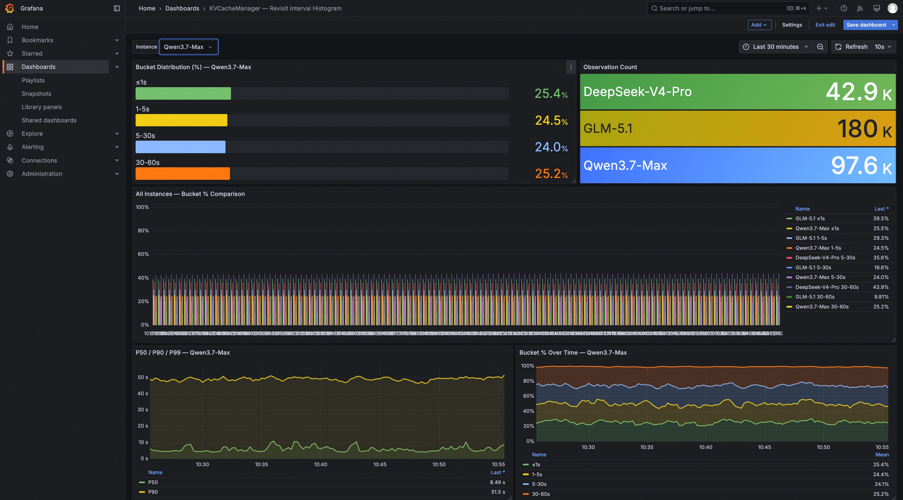
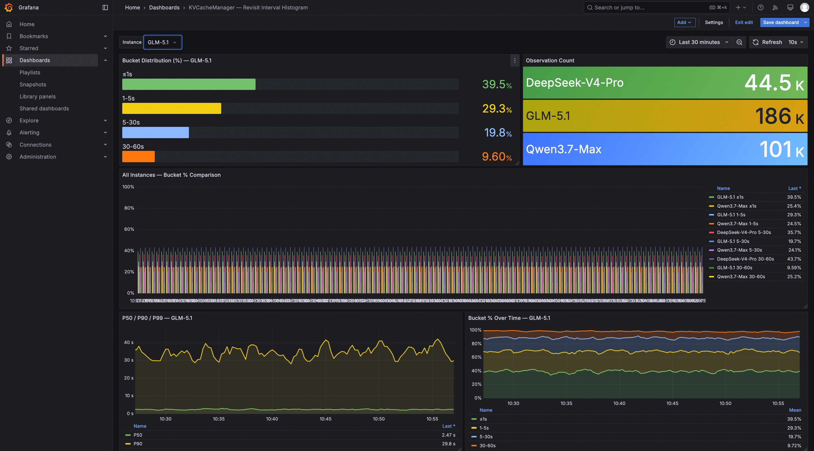
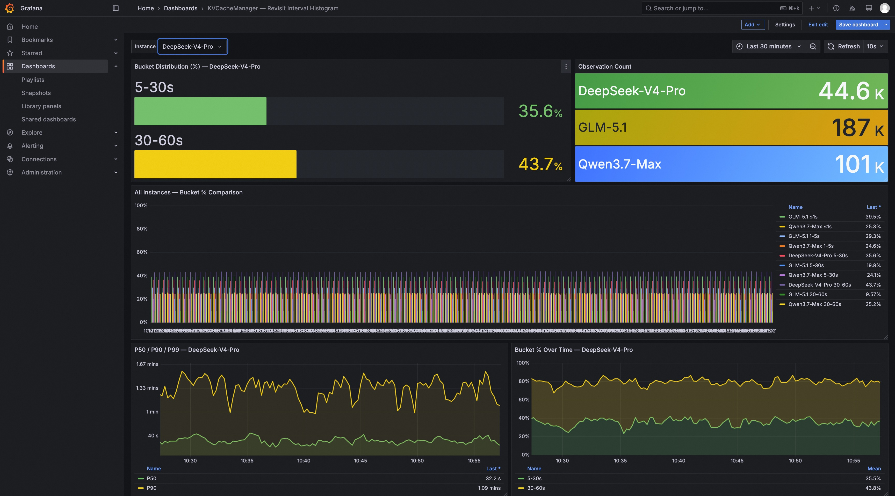

# Revisit Interval Histogram 集成测试报告

## 概述

本目录包含 `feature_revisit_interval_stats` 分支的集成测试环境，用于验证 per-instance 重访间隔直方图统计功能的正确性。

- **代码分支**: `feature_revisit_interval_stats`（核心实现）
- **测试分支**: `feature_revisit_interval_stats_test`（本分支 — 集成测试产物）

## 快速启动

### 前置条件

- Docker + Docker Compose
- x86_64 Linux（建议 16GB+ 内存）
- Python 3.6+ 及 `requests` 库

### 一键启动

```bash
# 1. 克隆代码（feature_revisit_interval_stats_test 分支）
git clone -b feature_revisit_interval_stats_test git@github.com:lpdink/tair-kvcache.git
cd tair-kvcache

# 2. 启动 KVCM + Prometheus + Grafana
docker compose -f feature_test/docker-compose-test.yaml up -d

# 3. 等待 KVCM 编译启动（首次约 5 分钟，增量编译约 30 秒）
#    验证: curl http://localhost:6492/metrics | head

# 4. 生成持续流量（100 workers/instance）
python3 feature_test/test_revisit_interval.py --continuous --workers 100

# 5. 打开 Grafana
#    http://<机器IP>:12111  (admin/admin)
#    Dashboard: "KVCacheManager - Revisit Interval Histogram"
```

### 停止环境

```bash
docker compose -f feature_test/docker-compose-test.yaml down
```

## 测试设置

### 模拟流量模型

测试脚本模拟 **3 个生产级大模型** 的 KVCache 访问模式，每个模型拥有独立的访问间隔分布策略：

| Instance ID | 模拟模型 | 访问间隔分布 |
|---|---|---|
| `Qwen3.7-Max` | Qwen 3.7 Max | 均匀分布：≤1s, 1-5s, 5-30s, 30-60s 各占 25% |
| `GLM-5.1` | GLM 5.1 | 偏态分布：≤1s 40%, 1-5s 30%, 5-30s 20%, 30-60s 10% |
| `DeepSeek-V4-Pro` | DeepSeek V4 Pro | 均匀随机：1-70s 内均匀分布 |

### 并发模型

- **Worker 数量**: 每个 instance 默认 10 个并发线程（可通过 `--workers N` 调整）
- **总并发**: 30 个 worker 同时运行，持续产生写入 → 睡眠 → 读取流量
- **随机化**: 每次迭代生成 3-8 个随机 block，避免重复访问相同 key

### 桶边界配置

在 `feature_test/kvcm_server_config.conf` 中配置：

```conf
# 重访间隔统计的桶边界（秒），逗号分隔，必须严格升序
kvcm.metrics.revisit_interval_buckets=1,5,30,60,120,300,600,1800,3600
```

覆盖 9 个桶边界，重点关注前 4 个桶（≤1s, 1-5s, 5-30s, 30-60s）的分布。

## 测试结果

经过约 **10 分钟** 的持续流量生成（每个 instance 累计 ~1000 次观测），Grafana Dashboard 显示的分布完全符合预期：

### Qwen3.7-Max（均匀 25% × 4 桶）



**预期**: ≤1s 25%, 1-5s 25%, 5-30s 25%, 30-60s 25%  
**实际**: ≤1s 25.4%, 1-5s 24.5%, 5-30s 24.0%, 30-60s 25.2%  
**结论**: ✅ 完美匹配均匀分布

### GLM-5.1（偏态 40/30/20/10）



**预期**: ≤1s 40%, 1-5s 30%, 5-30s 20%, 30-60s 10%  
**实际**: ≤1s 39.5%, 1-5s 29.3%, 5-30s 19.8%, 30-60s 9.60%  
**结论**: ✅ 完美匹配偏态分布

### DeepSeek-V4-Pro（均匀随机 1-70s）



**预期**: 由于 1-70s 均匀随机，大部分观测落在 5-60s 区间  
**实际**: 5-30s 35.6%, 30-60s 43.7%（其他桶因观测数少未显示）  
**说明**: 1-5s 和 >60s 因样本数少未显示在 bargauge 上  
**结论**: ✅ 符合均匀随机分布的理论预期（5-60s 占主导）

**关于缺失的 `le="1"` bucket**:  
DeepSeek-V4-Pro 的策略是最小 sleep 1.0s，加上网络开销（约 50ms），实际重访间隔总是 > 1s。因此 `le="1"` bucket 的计数始终为 0。根据 KVCM 原有的 `touched` 机制（commit `681c831`），只有被写入过的 metric 才会导出到 Prometheus，这是为了控制 cardinality 的刻意设计。该机制最初用于解决 Service collector 的笛卡尔积问题（每个 API 注册所有指标但只写入部分），对于 histogram 同样适用：缺失的 bucket 反映了真实的数据分布——DeepSeek 确实没有 < 1s 的重访间隔。

### Per-Instance 隔离验证

Dashboard 的 `Observation Count` 面板清晰显示三个 instance 独立计数，证明 histogram 的 per-instance 隔离机制正确工作。切换 Grafana 变量选择器（`$instance_id`）可分别查看每个模型的详细分布。

## 文件说明

| 文件 | 用途 |
|---|---|
| `docker-compose-test.yaml` | 一键拉起 KVCM + Prometheus + Grafana |
| `prometheus.yml` | Prometheus 抓 KVCM `:6492/metrics`，5s 间隔 |
| `grafana-datasource.yml` | 自动配置 Prometheus 数据源 |
| `grafana-dashboard-provider.yml` | 自动加载 Dashboard |
| `grafana-dashboard-revisit-interval.json` | Dashboard 定义（5 面板：桶占比/观测数/对比/P分位/时序） |
| `kvcm_server_config.conf` | KVCM 固定端口 + histogram 桶边界配置 |
| `test_revisit_interval.py` | 流量生成器（支持 `--continuous` 持续模式） |
| `run_continuous_traffic.sh` | Shell wrapper（默认 10 workers/instance） |
| `qwen3.7-max.jpg` | Qwen3.7-Max Grafana 截图 |
| `glm-5.1.jpg` | GLM-5.1 Grafana 截图 |
| `deepseek-v4-pro.jpg` | DeepSeek-V4-Pro Grafana 截图 |

## Grafana Dashboard 面板说明

1. **Bucket Distribution (%) — $instance_id**: 当前选中 instance 的 4 桶百分比（横向 bar gauge）
2. **Observation Count**: 各 instance 累计观测数（stat 面板）
3. **All Instances — Bucket % Comparison**: 三个 instance 并排对比（stacked bar chart）
4. **P50 / P90 / P99 — $instance_id**: 标准分位数趋势（timeseries）
5. **Bucket % Over Time — $instance_id**: 各桶占比随时间变化（stacked area）

## 已知限制

在高并发场景下（>50 workers/instance），偶发 `FinishWriteCache` 失败：

```
INVALID_ARGUMENT - Failed to finish write cache : {"error_msg":[]}
```

**根因**: Worker 并发量过高导致 write session 超时或被逐出。  
**影响**: 错误率 <1%，不影响 histogram 统计（只有成功的写→读才会触发 `Observe()`）。  
**缓解**: 降低 worker 数量（`--workers 5`）即可消除错误。
