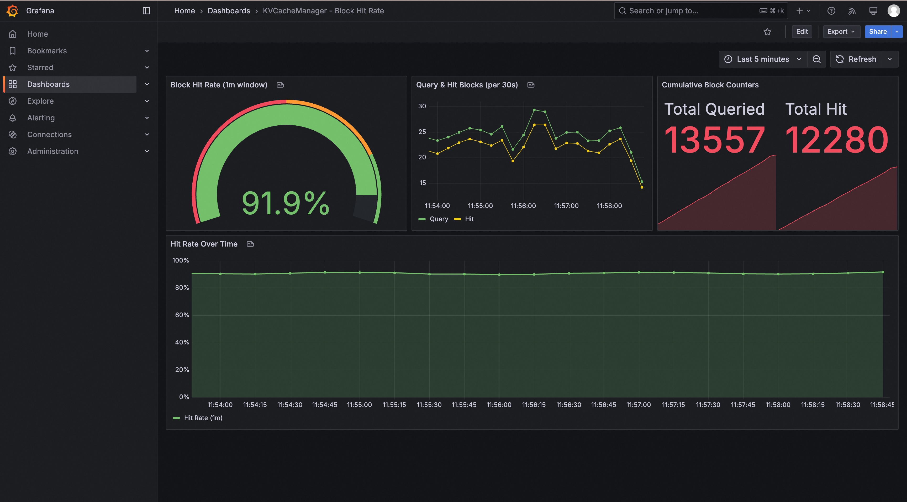

# GetCacheLocation Block 级命中率指标 — 测试报告

## 概述

本目录包含复现 GetCacheLocation Block 级命中率 Counter 指标集成测试所需的全部文件。

- **代码分支**: `feature_cache_hit`（代码变更）
- **测试分支**: `feature_cache_hit_test`（本分支 — 测试产物）

## 新增指标

| 指标 | 类型 | 说明 |
|---|---|---|
| `manager.get_cache_location_query_block_counter` | counter | GetCacheLocation 查询的 Block 总数（累计） |
| `manager.get_cache_location_hit_block_counter` | counter | GetCacheLocation 命中的 Block 总数（累计） |

**Grafana 命中率 PromQL**:
```promql
sum(rate(kvcm_manager_get_cache_location_hit_block_counter[1m]))
  / sum(rate(kvcm_manager_get_cache_location_query_block_counter[1m]))
```

## Grafana Dashboard 截图



Dashboard 包含 4 个面板：
- **Block Hit Rate (1m window)**: 实时命中率仪表盘（红/黄/绿阈值）
- **Query & Hit Blocks (per 30s)**: 查询与命中 Block 速率时序图
- **Cumulative Block Counters**: 累计查询/命中总数
- **Hit Rate Over Time**: 命中率时序趋势

## 快速复现

### 前置条件
- Docker + Docker Compose
- x86_64 Linux（建议 16GB+ 内存）
- Python 3.6+ 及 requests 库

### 步骤

```bash
# 1. 克隆代码（feature_cache_hit 分支）
git clone -b feature_cache_hit git@github.com:lpdink/tair-kvcache.git
cd tair-kvcache

# 2. 一键启动 KVCM + Prometheus + Grafana
docker compose -f feature_test/docker-compose-test.yaml up -d

# 3. 等待 KVCM 编译启动（首次约 5 分钟，增量编译约 30 秒）
#    验证: curl http://localhost:6492/metrics | head

# 4. 生成模拟流量（5 个模型实例轮转，命中率 80-100%）
for i in $(seq 1 40); do python3 feature_test/test_hit_rate_metrics.py; sleep 3; done

# 5. 打开 Grafana
#    http://<机器IP>:12111  (admin/admin)
#    Dashboard: "KVCacheManager - Block Hit Rate"
```

### 停止环境

```bash
docker compose -f feature_test/docker-compose-test.yaml down
```

## 文件说明

| 文件 | 用途 |
|---|---|
| `docker-compose-test.yaml` | 一键拉起 KVCM + Prometheus + Grafana |
| `prometheus.yml` | Prometheus 抓 KVCM `:6492/metrics` |
| `grafana-datasource.yml` | 自动配置 Prometheus 数据源 |
| `grafana-dashboard-provider.yml` | 自动加载 Dashboard |
| `grafana-dashboard.json` | Dashboard 定义（gauge + timeseries + stat） |
| `kvcm_server_config.conf` | KVCM 固定端口配置 (6381/6382/6491/6492) |
| `test_hit_rate_metrics.py` | 流量生成器 + 集成测试脚本 |
| `grafana_cache_hit.jpg` | Grafana Dashboard 截图 |

## 流量模拟设计

`test_hit_rate_metrics.py` 模拟 5 个模型部署：

| instance_id | 模拟模型 |
|---|---|
| `qwen-72b-fp8` | Qwen 72B FP8 |
| `glm-4-fp8` | GLM-4 FP8 |
| `kimi-k2-fp8` | Kimi K2 FP8 |
| `deepseek-v3-fp8` | DeepSeek V3 FP8 |
| `minimax-01-fp8` | MiniMax 01 FP8 |

每次运行：
1. 随机选择一个模型（instance_id）
2. 写入 5-15 个随机 Block
3. 发送 2-5 次 PrefixMatch 查询，命中率 80-100%
4. 通过 `/metrics` 端点验证 Counter 增量正确

## 单元测试结果

```
//kv_cache_manager/metrics/test:MetricsCollectorTest    PASSED
//kv_cache_manager/manager/test:CacheManagerTest        PASSED
```

## 代码变更摘要

7 files, +127 lines:
- `metrics_collector.h/cc` — 声明并注册 2 个 Counter 指标
- `cache_manager.cc` — 在 GetCacheLocation 返回路径累加命中计数
- `kmonitor_metrics_reporter.cc` — KMonitor 管线同步注册
- `prometheus-zh_CN.md` — 文档补充 + PromQL 示例
- `metrics_collector_test.cc` — Counter 初始化与累加 UT
- `cache_manager_test.cc` — 端到端写入+查询+计数 UT
